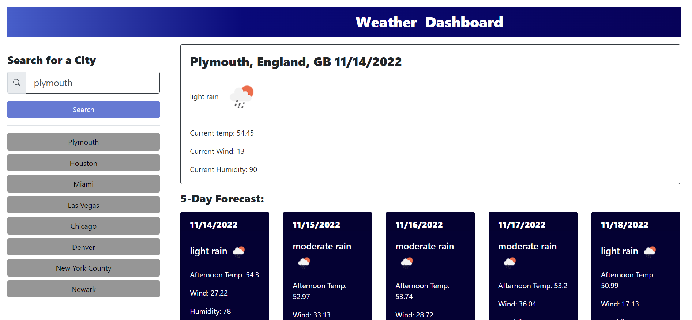

# Byte Weather

## Description

A weather dashboard utilizing the Open Weather API

## Usage

Enter in a city and watch it pull up the weather.

## Link to Deployed Application

[Deployed Application](https://lesley-byte.github.io/byteWeather/)

## Screenshot

## Testing

Check if its up to date occasionally

## License

Mit License

## Badges

## Contributing

## Credits
